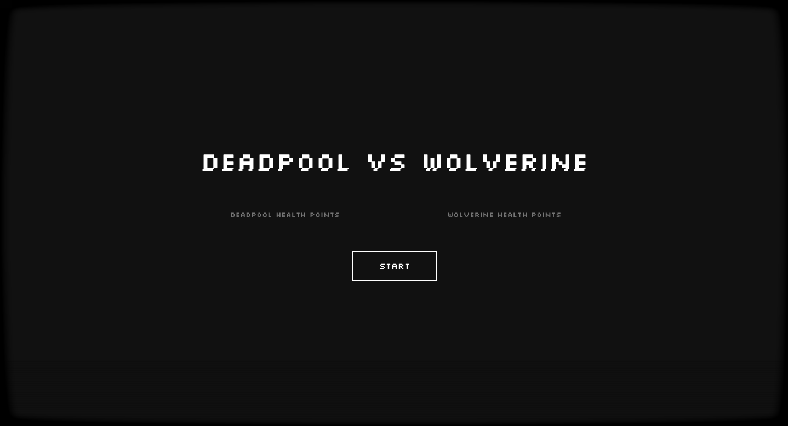
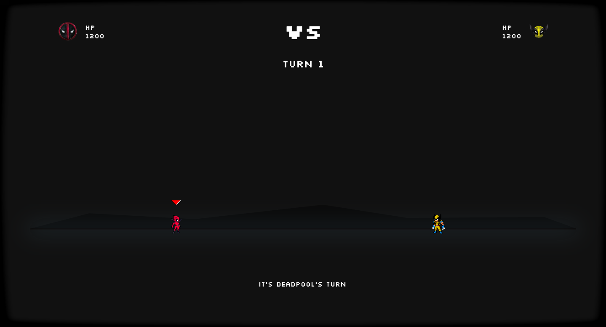

# Deadpool VS Wolverine

This project is inspired by one of the programming challenges from Brais Moure, to which I decided to add sprite animations using HTML, CSS, and JavaScript.

🚀 Live Demo: https://emedevelopa.github.io/DeadpoolVSWolverine/

## Challenge Objective

The game simulates a battle between Deadpool and Wolverine, where the user can set the initial health of each character, and the fight unfolds automatically based on predefined rules.

## Battle Rules

Initial Health: The user selects the starting health for each character.

### Random Damage:

🟥 Deadpool: Deals between 10 and 100 damage points.

🟨 Wolverine: Deals between 10 and 120 damage points.

### Critical Hit:

If a character takes the maximum damage, they lose their next turn to recover (but don’t regain health).

### Dodge Chance:

Deadpool has a 25% chance to dodge an attack.

Wolverine has a 20% chance to dodge an attack.

### End of Battle:

The first character to reach 0 or less health points loses the fight.

## Game Features
Automatic battle simulation.

Displays the turn number, with a 1-second pause between turns.

Logs all battle events (attacks, dodges, and regenerations).

Shows each character’s health after every turn.

Final message announcing the winner.

## Screenshots

🚀 Live Demo: https://emedevelopa.github.io/DeadpoolVSWolverine/

